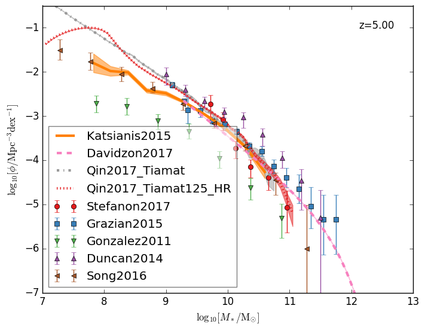

AstroDataPy
===========

.. image:: http://img.shields.io/badge/powered%20by-AstroPy-orange.svg?style=flat
    :target: http://www.astropy.org
    :alt: Powered by Astropy Badge
.. image:: https://travis-ci.com/qyx268/astrodatapy.svg?branch=master
    :target: https://travis-ci.com/qyx268/astrodatapy

Python tools to collect astronomical data.

This is a python package dedicated to collect up-to-date astronomical 
data from both observational and modelling campaigns, with a focus on 
galaxy properties. Current package includes 1) statistical properties 
such as the number densities of galaxies (as functions of stellar mass, 
UV magnitude, star formation rate) and AGN (as functions of black hole 
mass, quasar UV/optical/bolometric luminosities); 2) correlations between 
galaxies properties such as the Magorrian relation, Tully Fisher relation, 
Disk size - stellar mass relation, and halo - stellar mass relation, etc; 
and 3) clustering of quasars such as the two point correlation function.

Current modelling results include DRAGONS (Meraxes).

Installation
============

``$ pip install git+https://github.com/qyx268/astrodatapy``

Usage
=====

Example 1
---------
read quasar two point correlation function at z = 4 with a redshift range of [3.5, 4.5]

.. code:: python

    >>> from astrodatapy.clustering import clustering
    >>> obs = clustering(feature = 'QC_2PTCF', z_target = 4.0, z_tol = 0.5)
        You are requesting QC_2PTCF at z_target=4.00 with a tolerance of z_tol=0.50 and h=1.000
        quiet=True to silent
        available data of QC_2PTCF includes:
        Shen2007 Shen2009 He2018 Eftekharzadeh2015 Chehade2016 Retana-Montenegro2016
        
        Loading observational data from He2018...
        Filename /home/yqin/.local/lib/python3.6/site-packages/astrodatapy-0.0.dev29-py3.6.egg/astrodatapy/data//QC_2PTCF/z3pt8.dat                                                                                
        ..done
    >>> # show all available data of QC_2PTCF
    >>> print(obs.available_observation)
        ['Shen2007' 'Shen2009' 'He2018' 'Eftekharzadeh2015' 'Chehade2016'
        'Retana-Montenegro2016']
    >>> # show redshifts of all available data of QC_2PTCF
    >>> print(obs.z_available_observation)
        [0.6 1.5 3.8 2.5 3.2 4.5]
    >>> # show the target data of QC_2PTCF at z = 4
    >>> print(obs.target_observation)
                            DataType   FileName                                               Data
        Name                                                                                      
        He2018  PowerLaw_2COMPONENTS  z3pt8.dat  [[0.10115794542598985, 6345.99167885821, 12459...
        

Example 2
---------
read Magorrian Relation at redshift 0, output with h=0.678, and do not show information

.. code:: python

  >>> from astrodatapy.correlation import correlation
  >>> obs = correlation(feature = 'Magorrian', z_target = 0, quiet = 1, h = 0.678)

Example 3
---------
plot galaxy stellar mass function at redshift 5 and show labels

.. code:: python

    >>> import matplotlib.pyplot as plt
    >>> from astrodatapy.number_density import number_density
    >>> colors     = ['#e41a1c','#377eb8','#4daf4a','#984ea3','#ff7f00','#a65628','#f781bf','#999999'] * 4
    >>> markers    = ['o','s','v','^','<','>','p','*','D','.','8'] * 4
    >>> linestyles = ['-','--','-.',':']
    >>> 
    >>> z   = 5.0
    >>> obs = number_density(feature = 'GSMF', z_target = 5.0, quiet = 1, h=0.678)
    >>> 
    >>> j_data = 0
    >>> k_func = 0
    >>> fig, ax = plt.subplots(1, 1)
    >>> for ii in range(obs.n_target_observation):
    >>>     data       = obs.target_observation['Data'].iloc[ii]
    >>>     label      = obs.target_observation.index[ii]
    >>>     datatype   = obs.target_observation['DataType'].iloc[ii]
    >>>     color      = colors[ii]
    >>>     marker     = markers[j_data]
    >>>     linestyle  = linestyles[k_func]
    >>>     data[:,1:] = np.log10(data[:,1:])
    >>>     if datatype == 'data':
    >>>         ax.errorbar(data[:,0],  data[:,1], yerr = [data[:,1]-data[:,3],data[:,2]- data[:,1]],\
    >>>                     label=label,color=color,fmt=marker)
    >>>         j_data +=1
    >>>     elif datatype == 'dataULimit':
    >>>         ax.errorbar(data[:,0],  data[:,1], yerr = -0.2*data[:,1], uplims=True,\
    >>>                     label=label,color=color,fmt=marker)
    >>>         j_data +=1
    >>>     else:
    >>>         ax.plot(data[:,0],data[:,1],label=label,color=color,linestyle=linestyle,lw=3)
    >>>         ax.fill_between(data[:,0], data[:,2],data[:,3],color=color,alpha=0.5)
    >>>         k_func +=1
    >>> 
    >>> ax.set_xlim(7, 13)
    >>> ax.set_ylim(-7, -0.5)
    >>> ax.text(0.95,0.95, "z=%.2f"%z,horizontalalignment='right',\
    >>>       verticalalignment='top',transform=ax.transAxes)
    >>> leg = ax.legend(loc='lower left')
    >>> leg.get_frame().set_alpha(0.5)
    >>> ax.set_xlabel(r"$\log_{10}[M_*/{\rm M_{\odot}}]$")
    >>> ax.set_ylabel(r"$\log_{10}[\rm \phi/Mpc^{-3} dex^{-1}]$")
    >>> plt.savefig('./GSMF.png',bbox_inches='tight')
   

More examples can be found in `this jupyter notebook <astrodatapy/utils/plots.ipynb>`_.

Documentation
=============

http://astrodatapy.readthedocs.io

Features
============

Number density
--------------

==============             ==========================================
**Features**               **Descriptions**
--------------             ------------------------------------------
BHM                        Black Hole Mass
BHMF                       Black Hole Mass Function
GLF_UV                     Galaxy Luminosity Function -- UV
GSMF                       Galaxy Stellar Mass Function -- all
GSMF_Blue                  Galaxy Stellar Mass Function -- blue
GSMF_Bulge                 Galaxy Stellar Mass Function -- bulge
GSMF_Disk                  Galaxy Stellar Mass Function -- disk
GSMF_Quiescent             Galaxy Stellar Mass Function -- quiescent
GSMF_Red                   Galaxy Stellar Mass Function -- red
QLF_bolometric             Quasar Luminosity Function -- bolometric
QLF_optical                Quasar Luminosity Function -- optical
QLF_UV                     Quasar Luminosity Function -- UV
SFRF                       Star Formation Rate Function
==============             ==========================================

Correlation
-----------

=========================  ================================================
**Features**               **Descriptions**
-------------------------  ------------------------------------------------
BHM                        Black Hole Mass
Magorrian                  Black Hole - Galaxy Bulge Mass Scaling Relation
Tully_Fisher               Mass - Velocity of Spiral Galaxies
DiskSize_StellarMass       DiskSize - StellarMass
GasFraction_StellarMass    GasFraction - StellarMass
sSFR_StellarMass_Blue      sSFR - StellarMass -- blue
HaloMass_StellarMass       HaloMass - StellarMass
HaloMass_StellarMass_Blue  HaloMass - StellarMass -- blue
HaloMass_StellarMass_Red   HaloMass - StellarMass -- red
=========================  ================================================

Clustering
----------

==============             =================================================
**Features**               **Descriptions**
--------------             -------------------------------------------------
QC_2PTCF                   Quasar Clustering -- 2 point correlation function
==============             =================================================

License
=======

* Free software: BSD license

* This project is Copyright (c) Yuxiang Qin and licensed under the terms of the BSD 3-Clause license. See the licenses folder for more information.

Contributors
============

* Yuxiang Qin (The University of Melbourne)
